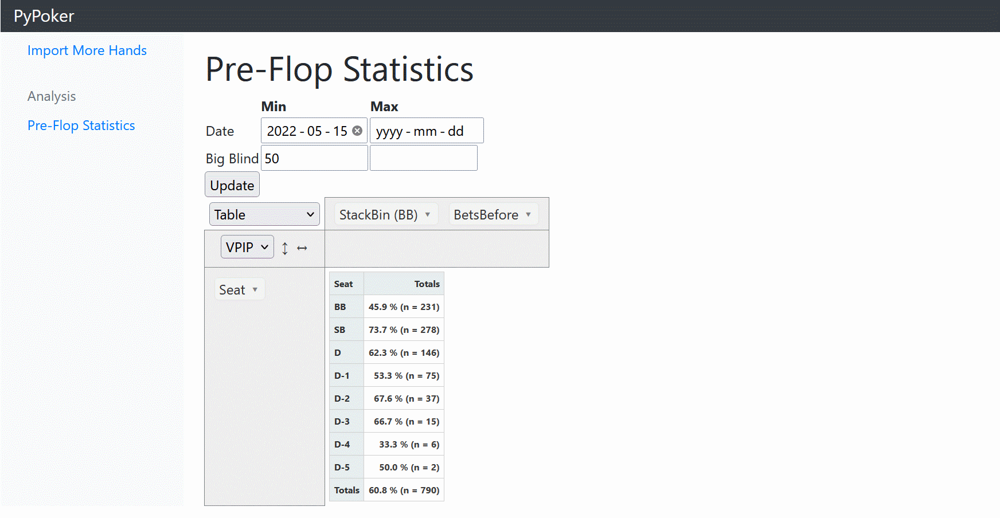

# PyPoker <!-- omit in toc -->
An open source poker hand tracker built in Python.

PyPoker runs as a Django web app allowing you to analyze a history of Texas Hold 'Em poker hands.

PyPoker's database and analytics are designed to support generic Hold 'Em hands, regardless of the site they are played on. Today, hand histories can only be imported directly from one site: [blockchain.poker](https://blockchain.poker). One day, this project may support more sites.

## Disclaimers <!-- omit in toc -->
- I am in no way affiliated with the blockchain.poker or any other online poker site
- I am not a web developer by trade, and I am *especially* not a front-end developer. PyPoker's front-end UI/UX/toolchain is far from optimal. If you want to make it better, see [here](#want-to-contribute)

## Contents <!-- omit in toc -->
- [User Guide](#user-guide)
  - [Importing Hands](#importing-hands)
  - [Analytics](#analytics)
    - [Pre-Flop](#pre-flop)
- [Developer Guide](#developer-guide)
  - [Initial Setup](#initial-setup)
- [Want to Contribute?](#want-to-contribute)

# User Guide
To have a hand history to analyze, go to [blockchain.poker](https://blockchain.poker) and play. Create a username and password for your account. These credentials will be necessary to import your hand history.

The complete setup steps are covered in the [Developer Guide](#developer-guide). To open PyPoker, run `python manage.py runserver` and open a web browser to http://127.0.0.1:8000/

## Importing Hands
Click *Import More Hands* and enter your site credentials. Recent hands that are available will be imported.

## Analytics
### Pre-Flop
The *pre-flop statistics* tab lets you analyze your VPIP (voluntarily puts money in pot) percentage across different positions, stack sizes and numbers of preceeding bets.

A player *voluntarily puts money in pot* whenever they make a pre-flop bet besides posting a blind. When any player except the big blind calls or raises pre-flop, they have voluntarily put money in. The big blind voluntarily puts money in if they raise, or if they call a bet larger than the big blind.

# Developer Guide
Prerequisites:
- Python + Anaconda
- Node

I have used Anaconda to manage virtual environments and dependencies, and ships with an `environment.yml` file. The setup steps that follow will detail this route, but using another package manager should be trivial.

## Initial Setup

Create and activate an Anaconda virtual environment:

`conda env create -f environment.yml`

`conda activate pypoker`

Install Javascript front-end dependencies (references `package.json`):

`npm install`

Collect and copy dependencies from `node_modules` to Django's static directory:

`python collect_from_npm.py`

Set up Django's database:

`cd pypoker`

`python manage.py migrate`

Run tests:

`python manage.py test`

You are ready to launch the app:

`python manage.py runserver`

# Want to Contribute?